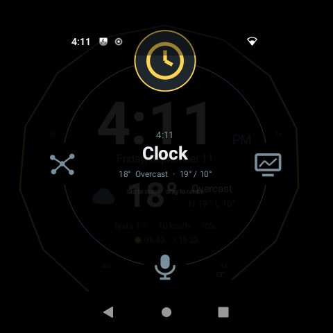
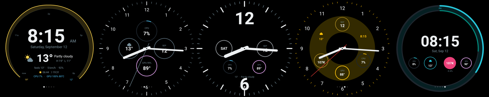
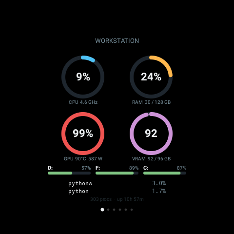
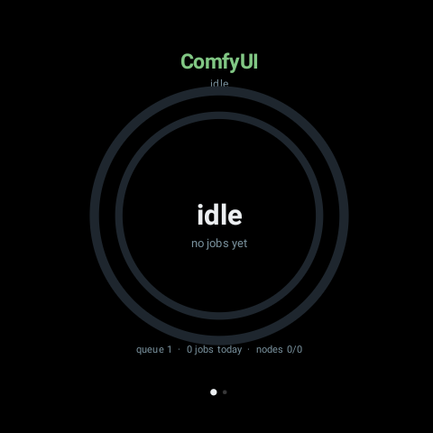
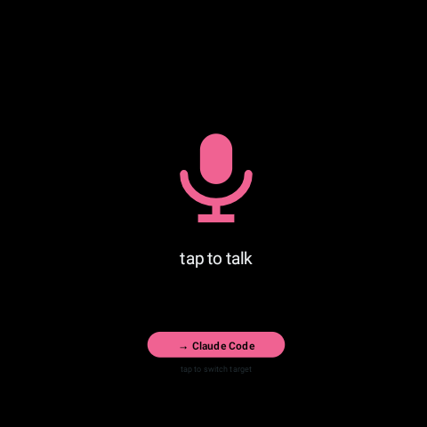
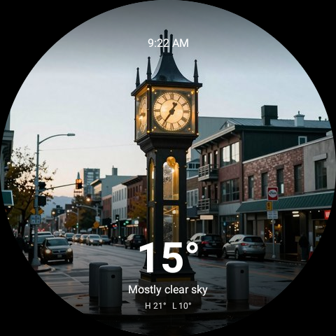

# EchoPortal

[](https://github.com/PartiallyFrozen/EchoPortal/actions/workflows/ci.yml)
[](https://github.com/PartiallyFrozen/EchoPortal/releases)
[](LICENSE)
[](docs/HARDWARE.md)
[](docs/AGENT.md)

Turn a first-generation Amazon Echo Spot into a round, always-on dashboard for your PC.

EchoPortal is two pieces: a Kotlin **shell** that runs as the launcher on an Echo Spot flashed with
LineageOS, and a small **Windows agent** in the system tray that feeds it live data over your LAN.
The Spot shows a ring of swipeable "faces": a clock with weather, real-time PC and GPU telemetry,
ComfyUI render progress, local voice dictation, market prices, generated weather art, and a monitor
for Claude Code.

No cloud service, no account, no Amazon software left on the device. The Spot talks to one machine
on your own network and nothing else.

| | | |
| :--: | :--: | :--: |
|  |  |  |
| Ring launcher | Clock styles | PC telemetry |
|  |  |  |
| ComfyUI progress | Voice dictation | Weather art |

## What it does

| Face | What it shows |
| --- | --- |
| **Clock** | Five styles, local weather, sunrise and sunset, CPU and GPU complications |
| **PC Mon** | Task-Manager-style pages: overview gauges, CPU, memory, GPU (3D/copy/VRAM), disks |
| **Voice** | Tap to talk. Whisper runs on your own GPU and types into the focused window |
| **ComfyUI** | Live render progress on the rim, then the finished image or a looping video |
| **Markets** | Streaming crypto and stock prices with auto-cycling pages |
| **Sky** | A pre-rendered painting matching the day's weather, refreshed as it changes |
| **Claude** | What Claude Code is doing right now, with a chime when it needs you |

The shell adds a ring launcher, a quick settings sheet, banners with a chime, an ambient dim mode
and a sleep schedule.

## Quick start

1. **Flash the Spot.** Unlock the bootloader with amonet, install TWRP, then LineageOS 18.1 for
   `rook`. Full walkthrough: [docs/FLASHING.md](docs/FLASHING.md). This erases the device and voids
   any warranty.
2. **Install the agent.** Download `EchoPortal-Agent-Setup.exe` from
   [Releases](https://github.com/PartiallyFrozen/EchoPortal/releases), run it, and let it start with
   Windows. It appears in the system tray.
3. **Set your location.** Edit `config.json` next to the agent (copied from
   [`packaging/config.example.json`](packaging/config.example.json)) with your latitude, longitude
   and time zone, then restart it from the tray.
4. **Install the shell.** Download `EchoPortal.apk` from the same release and push it:
   ```bash
   adb connect <spot-ip>:5555
   adb install -r EchoPortal.apk
   adb shell cmd package set-home-activity com.echoportal/.MainActivity
   ```
5. **Point it at your PC.** Long-press the screen, choose *PC agent address*, and enter
   `ws://<your-pc-ip>:8765`.

Building from source instead: [CONTRIBUTING.md](CONTRIBUTING.md).

## Requirements

- A first-generation Amazon Echo Spot (2017, model VN94DQ, codename `rook`). Later Echo Show
  devices are not supported.
- Windows 10 or 11 for the agent. It reads Windows performance counters and types into Windows
  windows, so macOS and Linux are not supported today.
- Optional: an NVIDIA GPU for the voice face, and a local ComfyUI install for the ComfyUI and Sky
  faces. Every other face works without them.

## How it fits together

```
Echo Spot (LineageOS 18.1)                Windows PC
┌──────────────────────────┐              ┌────────────────────────────┐
│ EchoPortal shell (Kotlin)│  WebSocket   │ tray.py  ─ system tray     │
│  ring launcher + faces   │◀────:8765───▶│ agent.py ─ hub + telemetry │
│                          │   HTTP :8766 │ comfy/ticker/voice/weather │
└──────────────────────────┘◀─── media ───└────────────────────────────┘
```

The agent broadcasts JSON on channels (`stats`, `comfy`, `ticker`, `weatherart`, `claude`, `notify`)
and serves transcoded clips over HTTP. Faces subscribe to the channels they care about. Details in
[docs/AGENT.md](docs/AGENT.md) and [docs/FACES.md](docs/FACES.md).

## Security

The agent listens on your LAN with no authentication, and the voice face can type into the focused
window. Run it only on a network you trust. See [SECURITY.md](SECURITY.md).

## License and affiliation

MIT, see [LICENSE](LICENSE). Not affiliated with, endorsed by, or connected to Amazon. "Echo" and
"Echo Spot" are trademarks of Amazon Technologies, Inc., used here only to identify the hardware
this project runs on. Flashing your device is at your own risk.
